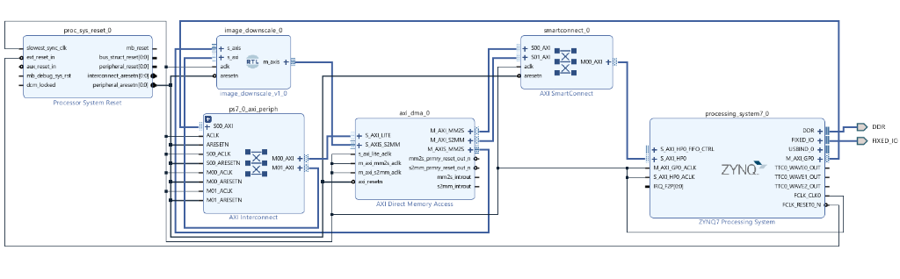

# Zynq Ethernet Image Downscaler

A bare-metal Zynq-7000 pipeline that receives an image from a PC over
Ethernet, downscales it 2x in each dimension using a custom AXI4-Stream
IP core in programmable logic, and sends the result back — all driven
by an AXI DMA engine under lwIP/TCP control.

Verified on ZYNQ hardware: `2738x1824` input -> `1369x912` output, repeatable,
over a direct 100 Mbps Ethernet link.


## Table of contents

- [Architecture](#architecture)
- [Block design](#block-design)
- [Repository layout](#repository-layout)
- [Protocol](#protocol)
- [Data path, step by step](#data-path-step-by-step)
- [Constraints](#constraints)
- [Network setup](#network-setup)
- [Usage](#usage)
- [BSP note](#bsp-note)

## Architecture

```
PC (Python) --TCP--> Zynq PS (lwIP) --> DDR --> AXI DMA --> PL downscaler
                                                     |
PC (Python) <--TCP-- Zynq PS <---------- DDR <-- AXI DMA
```

- **PS (Processing System)** — ARM Cortex-A9 running bare-metal firmware
  with lwIP. Owns the TCP server, DDR buffers, and DMA control.
- **PL (Programmable Logic)** — a custom `image_downscale` AXI4-Stream
  core that keeps the top-left pixel of every 2x2 block, plus an AXI DMA
  engine (MM2S/S2MM) moving pixels between DDR and the stream.
- **AXI4-Lite** — used by the PS to write runtime `width`/`height`
  registers into the downscaler before each frame.

## Block design



`processing_system7_0` (Zynq PS) drives `axi_dma_0` over AXI4-Lite/HP
ports. The DMA's `M_AXIS_MM2S` stream feeds `image_downscale_0`, whose
`m_axis` output feeds back into the DMA's `S_AXIS_S2MM` port. An AXI
Interconnect/SmartConnect fan out the control and memory-mapped ports
between the PS, DMA, and the downscaler's AXI4-Lite config interface.

## Repository layout

| Path | Contents |
|---|---|
| `Image Downscaler.xpr` | Vivado project file |
| `Image Downscaler.srcs/sources_1/new/image_downscale.v` | Downscaler RTL (AXI4-Stream in/out, AXI4-Lite config) |
| `Image Downscaler.srcs/sources_1/bd/design_1/` | Block design: PS7 + AXI DMA + downscaler |
| `Image Downscaler.srcs/sim_1/new/tb_image_downscale.v` | Icarus/Vivado testbench for the RTL |
| `sdk/PS_app/` | Bare-metal firmware: lwIP TCP server + DMA control |
| `sdk/PS_app_bsp/` | Board support package (see [BSP note](#bsp-note)) |
| `sdk/image_downscaler/` | HW platform (hdf + known-good bitstream) |
| `sdk/regen_bsp.tcl` | Script to regenerate the BSP |
| `host-python-script/app.py` | PC-side TCP client |
| `docs/` | Diagrams referenced by this README |

## Protocol

TCP port `5001`. All integers are little-endian `u32`; pixels are 4
bytes each (RGB + one pad byte).

```
host -> board : width, height, then width*height*4 bytes RGBA
board -> host : new_width, new_height, then new_width*new_height*4 bytes RGBA
```

## Data path, step by step

1. Firmware buffers the incoming pixels in DDR at `0x10000000`.
2. It writes `width`/`height` to the downscaler's AXI4-Lite registers at
   `0x43C00000` (reg 0 = width, reg 4 = height).
3. `Xil_DCacheFlushRange` pushes the image out of the CPU cache into real
   DDR so the DMA sees it.
4. S2MM is armed for the whole output frame at the top of DDR, then MM2S
   streams the input in <= 4 MB chunks through the downscaler.
5. The PL keeps only pixels where both the row and column counters are
   even, producing 1/4 of the input data; the final beat raises TLAST.
6. After S2MM completes, the output cache is invalidated and the result
   is queued back over TCP (drained progressively via the sent callback).

## Constraints

- **Even dimensions only** — the 2x2 block algorithm needs both width and
  height divisible by 2 (the client crops odd sizes automatically; the
  firmware rejects them outright).
- **Output <= 8,388,607 bytes** (~8 MB-1). The AXI DMA length register is
  23 bits and S2MM must be armed once for the whole frame — an S2MM
  transfer that completes mid-stream flags `DMAIntErr` and halts the
  channel. That means input <= ~32 MB. Larger images need scatter-gather
  mode or a wider length field.
- Max accepted payload: 256 MB (`MAX_IMG_BYTES`).

## Network setup

The board is statically configured for:

```
IP      : 192.168.1.10
Netmask : 255.255.255.0
Gateway : 192.168.1.1
MAC     : 00:0a:35:00:01:02
Port    : 5001
```

Give the PC's Ethernet adapter `192.168.1.2/24` (any unused `192.168.1.x`
works). Verify with `ping 192.168.1.10`.

## Usage

1. Open `Image Downscaler.xpr` in Vivado 2019.1, generate a bitstream if
   needed (the built bitstream is also in `sdk/image_downscaler/`).
2. Program the FPGA (SDK: *Xilinx Tools -> Program FPGA*, or via XSCT).
3. Run `PS_app` on the board (Debug As -> Launch on Hardware, or
   `dow PS_app.elf` in XSCT), then resume execution.
4. On the PC:

   ```bash
   cd host-python-script
   python3 app.py                          # uses test.jpg
   python3 app.py photo.jpg -o out.png
   python3 app.py --width 64 --height 64   # resize before sending
   ```

## BSP note

`sdk/PS_app_bsp` is checked in deliberately. `lwipopts.h` was
hand-patched with:

```c
#define CONFIG_LINKSPEED100 1
#define MEMP_NUM_TCP_SEG    1024
```

`regen_bsp.tcl` / `hsi generate_bsp` does **not** reliably re-apply those
parameters, and the default 256 TCP segments starves large transfers.
If you regenerate the BSP, re-patch both copies of `lwipopts.h` (under
`ps7_cortexa9_0/include/` and `libsrc/lwip211_v1_0/.../include/`) and
rebuild `liblwip4.a`.
